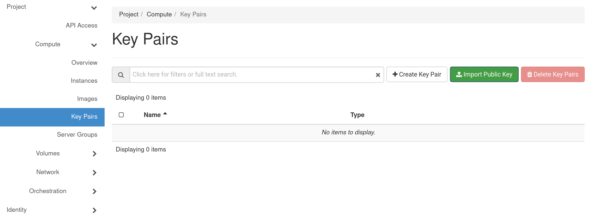
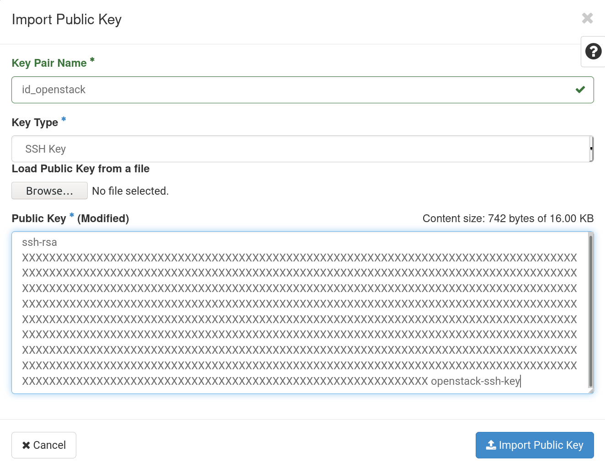
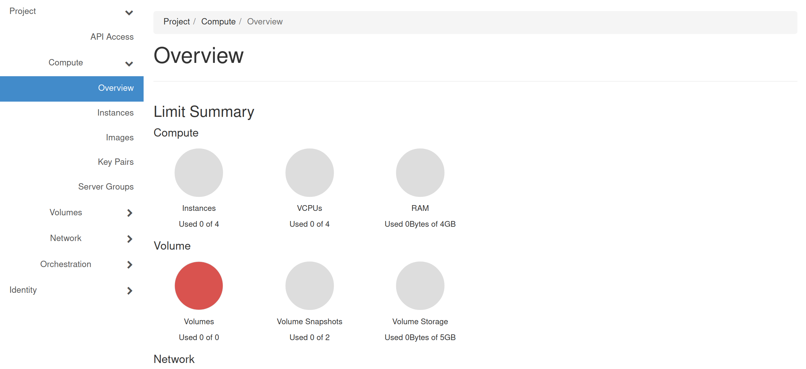
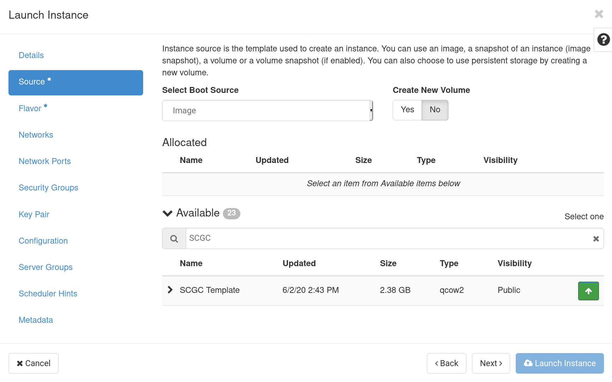
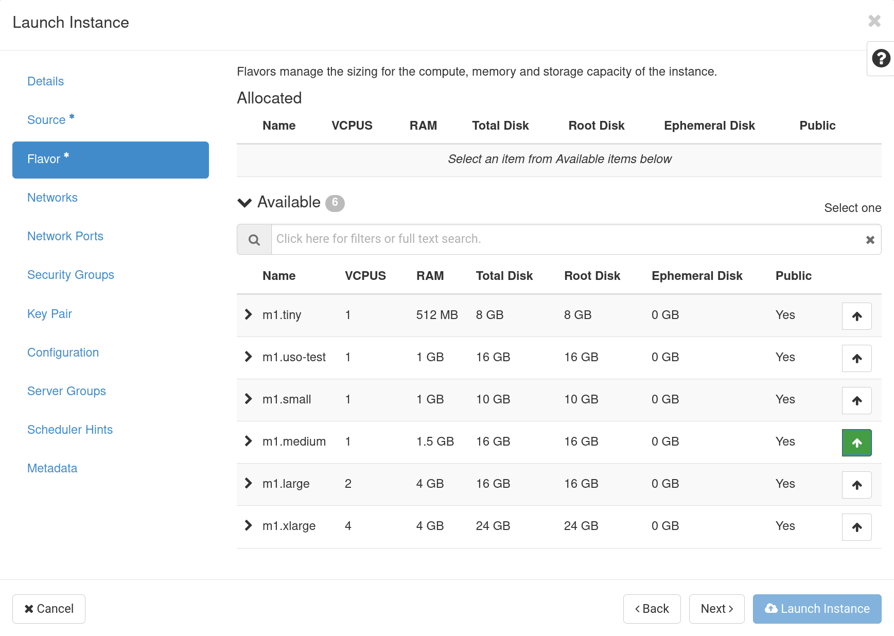
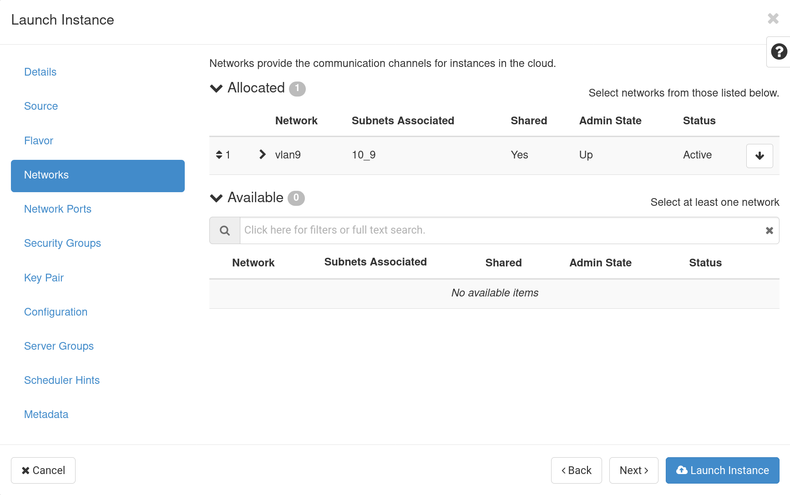
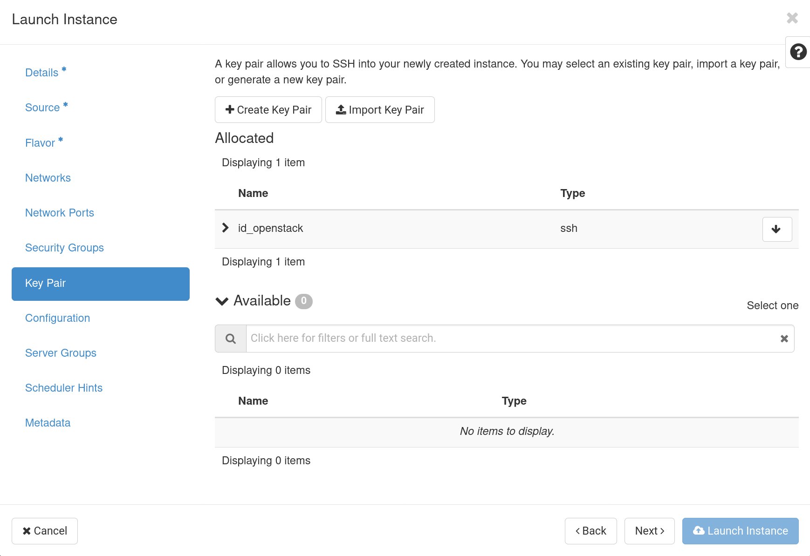
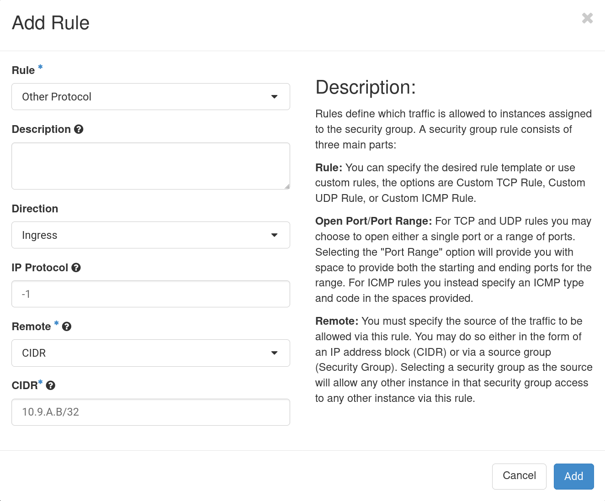

import Tabs from '@theme/Tabs';
import TabItem from '@theme/TabItem';

# Working with OpenStack

The faculty's cloud uses [OpenStack](https://www.openstack.org/) to provide
students with the ability to create and configure virtual machines in the faculty's cluster.

Connect to Horizon, the web front-end of Openstack, at https://cloud.grid.pub.ro/ and
authenticate using your LDAP username and password.

<!--
[//]: # (LDAP is used to centrally authenticate across all UPB services; we will go into more details about how LDAP can be configured in [[scgc:laboratoare:02]]).
-->

Most labs will rely on interacting with Openstack using Horizon.

Most virtual machine images (base virtual disks) use [cloud-init](https://cloudinit.readthedocs.io/en/latest/)
to automatically configure the virtual machine. As part of the first run of the virtual machine,
cloud-init will re-generate SSH host keys, reset the default user's password to an invalid value
(and usually make them a sudoer without requiring the password), disable root login,
and inject the user's keys into the virtual machine.

## Connection to proxy
We will use `fep.grid.pub.ro` as a proxy for our connections to the virtual machines.
You can connect to fep using `ssh user.name@fep.grid.pub.ro` and entering the OTP for your account when prompted.

We also recommend using `-o ServerAliveInterval=100` to instruct the SSH client to
send beacons to the server every 100 seconds, so you do not get disconnected due to inactivity,
and `-X` for X11 forwarding; the final command looks like:
```bash
ssh user.name@fep8.grid.pub.ro -X -o ServerAliveInterval=100
```
The short format will likely be enough in most cases.

:::tip Important
If you are using a Windows system, recommend creating a Linux virtual machine with a graphical interface, or a WSL Linux distribution. You could also use PuTTY as the SSH client.

:::

## SSH key pair generation

Because the virtual machine's user's password is reset to an invalid value by cloud-init,
you will not be able to log into the virtual machine using password login.
Instead, you must first create an SSH key that will be automatically added to the virtual machine's default user's authorized key.

First of all, you must generate an SSH key on fep. **Connect to fep** and run
the commands below to create a 4096-bit RSA key and print the public part of it.
The permissions on the `.ssh` directory must be `0700`, otherwise the ssh CLI tool will refuse to use the keys inside.

``` bash
[user.name@fep7-1 ~]$ mkdir -p ~/.ssh
[user.name@fep7-1 ~]$ chmod 0700 ~/.ssh
[user.name@fep7-1 ~]$ ssh-keygen -t rsa -b 4096 -f ~/.ssh/id_openstack -C "openstack-ssh-key"
[user.name@fep7-1 ~]$ cat ~/.ssh/id_openstack.pub
```

After having the public key, go to Horizon and access the `Project` &rarr; `Compute` &rarr; `Key Pairs` section.
Afterwards, click on the `Import Public Key` button (highlighted in green in the image below).



In the form, enter a name for the key, select `SSH Key` for `Key Type` and paste the public key into the `Public Key` field.



## Create virtual machines

Now that the SSH key pair is available, we can start creating virtual machines.
Note that you can only use a limited amount of total resources.
You can see graphs of the total amount of resources you can use, and the amount of
resources you have used so far through the Horizon interface, in the `Project` &rarr; `Compute` &rarr; `Overview` section.
In the image below, resources are limited to 4 CPU cores and 4GB of RAM.



To create a new virtual machine, go to `Project` &rarr; `Compute` &rarr; `Instances` and click on `Launch Instance`.
This will open a configuration dialog where you must set the parameters for the virtual machine.

New virtual machines can only be configured using pre-defined configurations, called `Flavors` with a set number of resources in each category.

When creating a virtual machine, you have to setup the virtual machine’s configuration. After pressing `Launch instance`,
a configuration window such as the one in the image below will be displayed on screen.

:::tip Important
Menus where you can only choose one option will automatically use the option by default. However, if two or more options are available (e.g., two networks or two SSH keys), you must choose one when creating each virtual machine. Otherwise, none will be chosen, and you may not be able to connect to the virtual machine.

:::

Make sure you go through each of the following tabs.

<Tabs>
<TabItem value="Details Menu" label="Details Menu" default>

In the Details Menu, you must provide a suitable name for your virtual machine. In our case, the virtual machine will be named `scgc-lab00`.


</TabItem>

<TabItem value="Source Menu" label="Source Menu">

In Source Menu, you must select the image template that will be the base of your virtual machine.
In the `Available` section, you will see several images from where you can choose the one that is suitable for your use case.
Choose `SCGC Template`, by clicking on the up arrow on the right.



</TabItem>

<TabItem value="Flavor Menu" label="Flavor Menu">

In OpenStack terminology, a `Flavor` is the predefined set of specifications that
will describe the resources that will be allocated to the guest when creating the virtual machine.
A flavor specifies the total disk size that can be used by the virtual machine, the number of virtual CPUs and the RAM amount that will be allocated during creation.
For this task, choose the `m1.medium` flavor that has `1` virtual CPU, `1.5GB` of RAM and `16GB` of disk space.



</TabItem>

<TabItem value="Network Menu" label="Network Menu">

In order to connect to the virtual machine, you must provide a network.
If not otherwise specified, always choose `vlan9`.
If the `vlan9` network is not present, you will not be able to connect to the virtual machine through SSH.



</TabItem>

<TabItem value="Key Pair" label="Key Pair">

In order to be able to connect to the virtual machine, you must provide a key pair.

:::tip Important
The key must be provided in this step. It cannot be added later because the key is injected into the virtual machine at creation time.

:::



</TabItem>
</Tabs>

### Launch instance

After setting up the previous configuration, you can press `Launch Instance`. After creation, you should see the following output:


In the previous image, you can see information about the newly created virtual machine:
  * **Instance Name**: `scgc-lab00` – the virtual machine’s name that was configured through the Details Menu
  * **Image Name**: `SCGC Template` – the virtual machine’s image that was chosen through the Source Menu
  * **IP Address**: `10.9.X.Y` – the IP address that is assigned for the virtual machine. We will use this IP address to connect to the virtual machine.
  * **Key Pair**: `id_openstack` – the key pair used for connection
  * **Actions** – drop down button from where you can reset, rebuild or delete the current instance.

:::tip important
The virtual machine will run on one of the servers in the cluster. If the server did not have the image before you tried creating the virtual machine, the image will have to be copied and converted on the server before being used. This means that sometimes the virtual machine will boot slower (up to 10 minutes of wait time). During this time, the ''Power State'' will be shown as ''Spawning''.

:::

## Connect to the virtual machine

The picture bellow shows how you can connect to the virtual machine.
Since the virtual machine runs in OpenStack (i.e. in the faculty's cluster) and the assigned IP address is a private address, you cannot directly connect to the virtual machine.


To connect to the virtual machine, you must first connect to fep, which is a front end computer that runs in the faculty's cluster (i.e. from here you can access the OpenStack network).
Then, connect to the virtual machine.
Pay attention to the IP address that was assigned to your virtual machine and to the keypair name you have previously created and provided to OpenStack.
Please note that the username you must use when logging in to the virtual machine may also differ. `SCGC Template` uses the username `student`.

```bash
[user.name@fep7-1 ~]$ ssh -i ~/.ssh/id_openstack student@10.9.X.Y
The authenticity of host '10.9.X.Y (10.9.X.Y)' can't be established.
...
Are you sure you want to continue connecting (yes/no)? yes # you have to write yes and press Enter
...
student@scgc-lab00:~$
```

Notice that the first time you want to connect to a new virtual machine, the SSH Agent will ask you to confirm the connection.


### Possible issues

<details>
<summary><b>Click to expand</b></summary>

When connecting through SSH, the following issues may appear:
  *  the virtual machine has started, but the SSH daemon has not started yet. In this case, you may see a connenction refused message. In this case, if the service should start at boot time, wait until the virtual machine finishes the booting process.
```bash
[user.name@fep7-1 ~]$ ssh -i ~/.ssh/id_openstack student@10.9.X.Y
ssh: connect to host 10.9.X.Y port 22: Connection refused
```
  * you have connected to a virtual machine with the same IP address in the past (you have created another virtual machine, or rebuilt the current one), and SSH had saved its key fingerprint. Because the virtual machines are initialized through ''cloud-init'' the SSH host keys will differ between instances. If this is the case, you must remove the SSH key entry in ''~/.ssh/known_hosts'' before attempting to connect again.
``` bash
[user.name@fep7-1 ~]$ ssh -i ~/.ssh/id_openstack student@10.9.X.Y
@@@@@@@@@@@@@@@@@@@@@@@@@@@@@@@@@@@@@@@@@@@@@@@@@@@@@@@@@@@
@    WARNING: REMOTE HOST IDENTIFICATION HAS CHANGED!     @
@@@@@@@@@@@@@@@@@@@@@@@@@@@@@@@@@@@@@@@@@@@@@@@@@@@@@@@@@@@
IT IS POSSIBLE THAT SOMEONE IS DOING SOMETHING NASTY!
Someone could be eavesdropping on you right now (man-in-the-middle attack)!
...
```
  * the virtual machine refused the SSH key (and will probably request password authentication). This is likely because the public SSH key is not in the virtual machine user's ''~/.ssh/authorized_keys'', because it was either removed, or not properly injected through ''cloud-init''. To check if the key was injected, click on the virtual machine in the ''Project'' &rarr; ''Compute'' &rarr; ''Instances'' section, and then navigate to the ''Log'' tab. If the key was added properly, you should see an output like the following towards the end of the log. If the key was not added, or was removed after logging in and you cannot access the virtual machine, you must remove and create the virtual machine again.
```bash
ci-info: +++++++++Authorized keys from /home/student/.ssh/authorized_keys for user student++++++++++
ci-info: +---------+-------------------------------------------------+---------+-------------------+
ci-info: | Keytype |                Fingerprint (md5)                | Options |      Comment      |
ci-info: +---------+-------------------------------------------------+---------+-------------------+
ci-info: | ssh-rsa | 00:11:22:33:44:55:66:77:88:99:aa:bb:cc:dd:ee:ff |    -    | openstack-ssh-key |
ci-info: +---------+-------------------------------------------------+---------+-------------------+
```

</details>

## Connect to the virtual machine with X forwarding

### OS
<Tabs>
<TabItem value="Linux" label="Linux" default>

Linux uses a client-server architecture for the X window system.
SSH allows you to forward graphical applications information through the X11 forwarding functionality.

Linux comes by default with the X11 client functionality, so if the SSH server allows X11 forwarding,
you can use the `-X` option when connecting to the remote system.
If you must go through multiple systems when connecting (e.g., you connect to **fep** before connecting to the Openstack virtual machine),
you must set this flag for each connection.

```bash
user@workstation ~ $ ssh -X user.name@fep.grid.pub.ro
...
[user.name@fep7-1 ~]$ ssh -X -i ~/.ssh/id_openstack student@10.9.X.Y
```

Because X11 will forward the entire graphical interface, we recommend using it rarely,
and even enabling compression by passing the `-C` flag to the SSH client.
If you only need to access information on a specific port using an application that
is already installed on your local system (e.g., a webpage that you access using a browser),
you should use the `-D` flag for dynamic port forwarding (proxy),
or `-L` for regular port forwarding (one-to-one).

</TabItem>

<TabItem value="MacOS" label="MacOS">

The MacOS SSH client has X11 forwarding functionality, but may not have an X11 server installed.
You must first install an X11 server before being able to forward the GUI.
Please follow these [instructions](https://medium.com/@toja/using-x11-apps-in-mac-os-x-c74b304fd128).
Afterwards, you can use the same commands described for the Linux client.

</TabItem>

<TabItem value="Windows" label="Windows" default>

If you are using a Linux virtual machine with a graphical user interface, you can use the steps described for the Linux client (above) immediately.
Otherwise, if you are using WSL, please try the steps described [here](https://techcommunity.microsoft.com/t5/windows-dev-appconsult/running-wsl-gui-apps-on-windows-10/ba-p/1493242) first;
afterwards, use the steps described for the Linux client.

</TabItem>
</Tabs>

### Testing
To test that X11 forwarding works, we will use some simple apps.
On the virtual machine, install `x11-apps` and the run `xeyes` or `xclock`.
If X11 port forwarding works properly, you should see a newly opened window on your system, with a pair of eyes that follow your mouse pointer, or an analog clock, respectively.
```bash
student@scgc-lab00:~$ sudo apt install -y x11-apps
student@scgc-lab00:~$ xeyes
student@scgc-lab00:~$ xclock
```

:::tip important
To open the SSH connections, you can open multiple SSH connections to the virtual machine in Openstack,
or use a terminal multiplexing application like `screen` or `tmux` (this is the recommended option, since it also allows you to not lose your session even when losing the internet connection).

For example, for tmux, write `tmux` in the virtual machine's terminal.
You will see a new interface appear, with a green ribbon at the bottom.
By default, tmux uses the `<C-b>` key combination as the control sequence
(`<C-b>` is the notation used by vim for "hold ctrl and press b", and we will use it here).
To create a second terminal in horizontal split mode, press `<C-b>"` (that is the key combination `ctrl+b` and then double quotes `"`).
Afterwards, you can navigate between the panes using `<C-b><arrow-key>` - e.g., `<C-b><down-arrow>` to go to the next pane down from your current position.

:::

## Advanced Network Configuration

<details>
<summary>Click to expand</summary>

If you cannot communicate with another virtual machine from OpenStack, it's because all traffic is Openstack is routed through a firewall.
To view the allowed rules in the default security policy (the one your virtual machine uses unless you have created another policy
group and set during the virtual machine's creation process), go to the Horizon dashboard, navigate to
`Project` &rarr; `Network` &rarr; `Security Groups` and click on `Manage Rules` for the desired security groups.

You can see that by default, all traffic generated by the virtual machine is allowed outside (the rules specifying the `Egress` direction,
for both IPv4 and IPv6 allow all IP protocols and port ranges, and to any IP (CIDR `0.0.0.0/0` for IPv4 and `::/0` for IPv6).

However, for input traffic, only specific ports are allowed from any IP (see the rules for IPv4 and CIDR `0.0.0.0/0`),
while other ports are only accessible from virtual machines with a network interface in the `default` security group
(the rules with `default` under the `Remote Security Group`).

Overall, these rules are meant to allow connections coming from any IP (e.g., fep) to access only certain services
(e.g., SSH on port 22, HTTP(S) on ports 80, 443 and 8080, RDP on port 3389, VNC on port 5901), while your virtual machines can communicate on any port.

To allow the other virtual machine to communicate with your virtual machine, click on `Add Rule` and select the `Other Protocol` rule, the `Ingress` direction, `-1` as IP protocol,
`CIDR` type for remote, and `10.9.A.B/32` (the desired virtual machine's IP address) for CIDR value.
You could also use `0.0.0.0/0` for CIDR, but this is less secure,
since it would allow any IP to connect to your virtual machine's ports,
thus all security measures will have to be implemented on the virtual machine itself.



</details>


## Delete the virtual machine
After each lab, and whenever you no longer need a virtual machine, please delete it.
Go to the Horizon dashboard, go to `Project` &rarr; `Compute` &rarr; `Instances` and delete the virtual machine.
You can either select all virtual machines your wish to delete from their checkbox on the left,
and then click on `Delete Instances`, or select `Delete instance` from the dropdown menu on the right.

It would also be a good idea to delete the security group rule you have previously created earlier if you do not need to allow communication with machines outside your project.
