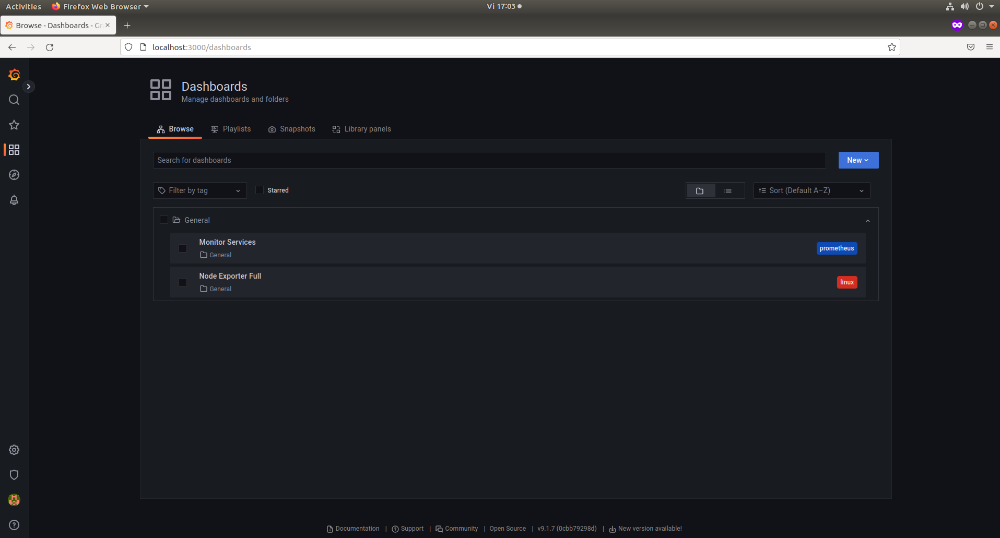
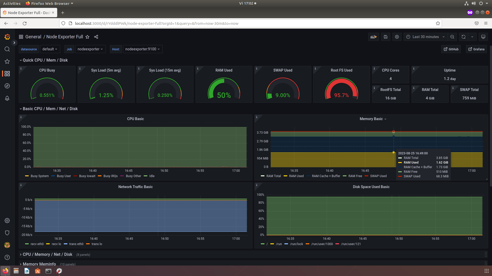

## Complex scenarios: Monitor a Minecraft server using Grafana and Prometheus

In the next sections, we will present a case study for running a Minecraft server and monitoring it using containers.

### Start a Minecraft server

To download a container image for a Minecraft server, we need to identify an already containerized service on DockerHub.

We will do this using the search function provided by the platform.

When choosing a container to use, we must consider the following factors:

* the number of people who have already downloaded the container; we want to use a service that has been used and verified by as many users as possible;
* the date of the last update; in general, the more recent the updates, the better the support for the service;
* the state of the documentation; the more complete and concise the configuration instructions are, the more we can count on not spending much time preparing the container's runtime environment.

According to the installation instructions on the container's page, we can start the service using the following command:

```bash
student@work:~$ docker run -d -p 25565:25565 -e EULA=true --name mc itzg/minecraft-server
    Unable to find image 'itzg/minecraft-server:latest' locally
    latest: Pulling from itzg/minecraft-server
    675920708c8b: Pull complete
    74b551139104: Pull complete
    c290a58bcfd7: Pull complete
    4d6bcabdde06: Pull complete
    02ff7afd9866: Pull complete
    58640237d5df: Pull complete
    d9165be859a2: Pull complete
    575fb4190f2f: Pull complete
    c3c6d5d36ce5: Pull complete
    9f1d7790dab7: Pull complete
    a7a32c154b26: Pull complete
    e253f974e9a6: Pull complete
    d61d99ed5e98: Pull complete
    c78f023f58b3: Pull complete
    70401c8e828a: Pull complete
    4f4fb700ef54: Pull complete
    087988aa5331: Pull complete
    13ee4174c665: Pull complete
    9381121a4fe0: Pull complete
    6a8a23430798: Pull complete
    b5b33c72ea51: Pull complete
    edf873f8c85d: Pull complete
    Digest: sha256:0697315bd265c751821d5796662436efd94edea8e77b42a7404dab22586af73f
    Status: Downloaded newer image for itzg/minecraft-server:latest
    53a920004fa8316ef87e4776f57f6b826825edf8237d08b9791c1936f40e50e2
    student@uso:~/.../labs/09-task-admin/lab-container$ docker image ls
    REPOSITORY              TAG       IMAGE ID       CREATED      SIZE
    itzg/minecraft-server   latest    616bdcb51f15   7 days ago   670MB
    student@uso:~/.../labs/09-task-admin/lab-container$ docker ps
    CONTAINER ID   IMAGE                   COMMAND    CREATED         STATUS                            PORTS                                                      NAMES
    53a920004fa8   itzg/minecraft-server   "/start"   5 seconds ago   Up 4 seconds (health: starting)   0.0.0.0:25565->25565/tcp, :::25565->25565/tcp, 25575/tcp   mc
```

We used the `--name` option of the `docker run` utility to specify an easy-to-remember name for the started container, in this case the name is `mc`. We added the `-p` option to open port `25565` on the machine on which the container is running, the port on which communication with the Minecraft server is made.

We notice that the container has been downloaded and started running.
To verify that we have downloaded the container image, we run the `docker image ls` command, which lists all the containers on the system.
We find in the list of containers the image with the name `itzg/minecraft-server`.

To verify the operation of the container we will connect to the Minecraft server using the port exposed above.

```bash
student@work:~$ curl localhost:25565
        {"translate":"disconnect.genericReason","with":["Internal Exception: io.netty.handler.codec.DecoderException: java.lang.IndexOutOfBoundsException: Index 69 out of bounds for length 1"]}
```

We notice that we got a Java error back, this means that the Minecraft server, which is based on the Java programming language, is reachable.
The error occurs because we were trying to access the container using an HTTP client, instead of using Java.

### Deploy Grafana and Prometheus using Docker Compose

As we can see from the example above, we can start containers using the `docker run` command, but that means running a separate command for each container.
This is simple when we only need to start two containers, but if we want to start more than two containers, or if we want to use a "one click" solution and use a suite of containers needed for our solution, we need a new way to start containers.

The solution to this problem is the Docker Compose service.

It allows a user to write a specification for a working environment, including options for running containers, the volumes attached to the containers, and the networks over which the containers will communicate.

The command used to manage containers is `docker-compose`, and the container specification is written in the `docker-compose.yml` file.

The format of the `docker-compose.yml` file is of the form:

```bash
     services:
            service_name:
                image: <image_name>
                volumes:
                    <volume_list>
                ports:
                    <open_ports_list>
                environment:
                    <environment_variables_list>
        volumes:
            <volume_name>:
        networks:
            <network_name>:
```

The Grafana visualization service is an industry standard for displaying graphs of various shapes and alerting based on user-specified conditions.

Grafana uses a database and an information aggregator.
A commonly used aggregator in Grafana is Prometheus, which can connect to external clients and download information from applications that expose information called exporters.

Both services use complex configuration files and variables to specify how they run.
Because of this, it is not easy to run their startup commands directly from the command line.

We want to monitor the Minecraft server, to see how resource usage changes.
We will use the `node-exporter` exporter to collect information about the system on which the server is running.

We will write the following YAML recipe in the `docker-compose.yml` file:

```bash
 version: '2.1'

        volumes:
            prometheus_data:
            grafana_data:

        services:

          prometheus:
            image: prom/prometheus:v2.37.9
            container_name: prometheus
            volumes:
              - ./prometheus:/etc/prometheus
              - prometheus_data:/prometheus
            command:
              - '--config.file=/etc/prometheus/prometheus.yml'
              - '--storage.tsdb.path=/prometheus'
              - '--web.console.libraries=/etc/prometheus/console_libraries'
              - '--web.console.templates=/etc/prometheus/consoles'
              - '--storage.tsdb.retention.time=200h'
              - '--web.enable-lifecycle'
            restart: unless-stopped
            ports:
              - 9090:9090

          nodeexporter:
            image: prom/node-exporter:v1.6.1
            container_name: nodeexporter
            volumes:
              - /proc:/host/proc:ro
              - /sys:/host/sys:ro
              - /:/rootfs:ro
            command:
              - '--path.procfs=/host/proc'
              - '--path.rootfs=/rootfs'
              - '--path.sysfs=/host/sys'
              - '--collector.filesystem.ignored-mount-points=^/(sys|proc|dev|host|etc)($$|/)'
            restart: unless-stopped
            ports:
              - 9100:9100

          grafana:
            image: grafana/grafana:9.1.7
            container_name: grafana
            volumes:
              - grafana_data:/var/lib/grafana
              - ./grafana/provisioning:/etc/grafana/provisioning
            environment:
              - GF_SECURITY_ADMIN_USER=admin
              - GF_SECURITY_ADMIN_PASSWORD=usorules
              - GF_USERS_ALLOW_SIGN_UP=false
            restart: unless-stopped
            ports:
              - 3000:3000
```

This file was generated based on an existing [open source repository](https://github.com/Einsteinish/Docker-Compose-Prometheus-and-Grafana/), adapted for our use case.

Entries under the `volumes` tag represent shared directories between the container and the physical system.
Container volumes provide persistence to the information recorded in the container.
By default, containers store information ephemerally, if a container has been deleted, the information within it has also been deleted.

A mounted directory is of the form `<source directory>:<destination directory>`.
If the source directory is not a path in the system, a volume is generated within the working directory of the Docker service.

The Grafana, Prometheus and `node_exporter` services are accessible over the network from a browser and communicate via ports.
In order to access these services, we need to expose the ports.
Port exposure is done under the `ports` tag, with each port defined as `<source port>:<destination port>`.

Containerized services are configured using the `environment` tag.
The Grafana system password was configured using the `GF_USERS_ADMIN_USER` and `GF_SECURITY_ADMIN_PASSWORD` environment variables.

### Connect to the GUI

We will authenticate to the virtual machine at the monitoring service in the browser at the
address `localhost:3000`.
We have set the administrator user `admin` and the password `usorules`.
We will be asked to modify this information.

Once authenticated, click on the dashboards button, then on browse and access the `Node Exporter Full` panel by clicking on its name.



Displaying information in Grafana is done using dashboards.
These can be generated dynamically by users, or they can be downloaded as JSON files.
Within the current infrastructure, we downloaded the `Node Exporter Full` dashboard, where we can track details about resources used, such as network traffic or how much memory is used.



When using `docker-compose` based services, it is not enough to have a `docker-compose.yaml` file.
Services are also configurable through configuration files that we must define.
Within the working directory (`grafana/`), we generated the configuration files for the Prometheus and Grafana services.
These files configure Prometheus to connect to `node_exporter` and configure Grafana to display the information stored in Prometheus.
These files are not relevant for a simple setup, the advantage of using containerized services is precisely the fact that we do not have to write all the configuration files ourselves and we have an already functionally configured service.

We observe below the complete file hierarchy:

```bash
       grafana
        ├── docker-compose.yml
        ├── grafana
        │   └── provisioning
        │       ├── dashboards
        │       │   ├── 1860_rev31.json
        │       │   ├── dashboard.yml
        │       │   └── monitor_services.json
        │       └── datasources
        │           └── datasource.yml
        └── prometheus
            └── prometheus.yml
```

### Exercise: Installing a media hosting service (Plex)

An example of using Docker containers in an easy way is to host a private media server.
The service provided is like using the Netflix or Disney+ service hosted on your own computer.
Media hosting services are used to manage your own media library, organizing, sorting and downloading metadata in a centralized portal.
Another advantage of these services is that they can be viewed on any device that has access to the computer running the container through a browser, whether it is a TV, tablet or mobile phone.

The Plex service is one of the best-known media hosting services.
It can manage audio, photo and video content.
The service can be run natively within the system, or it can run in the container.
The advantage of using Plex in a container is the ease of installation and management of the system.
It is enough to just download the container and start it using the `docker-compose` command.

For this exercise, it is enough to search for a container image for the Plex service on the [DockerHub](https://hub.docker.com/) platform.

We notice that we have two possibilities of official containers, the first is
packaged and provided by [linuxserver.io](https://hub.docker.com/r/linuxserver/plex), and the second is provided by [Plex Inc](https://hub.docker.com/r/linuxserver/plex/).

We will use the solution provided by linuxserver.io, since they generally provide containers that are optimally packaged for use in containers.

Based on the `docker-compose.yaml` sample file provided by linuxserver.io on the Docker Hub page, configure it to start a Plex media server that has the library loaded using a volume in the `plex` directory and exposes port 32400 to the host system.

Verify that you can play the song loaded in the `plex` directory using Plex.
