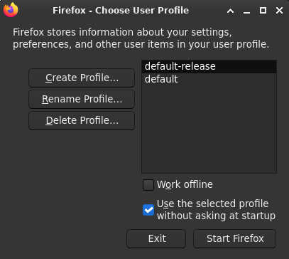
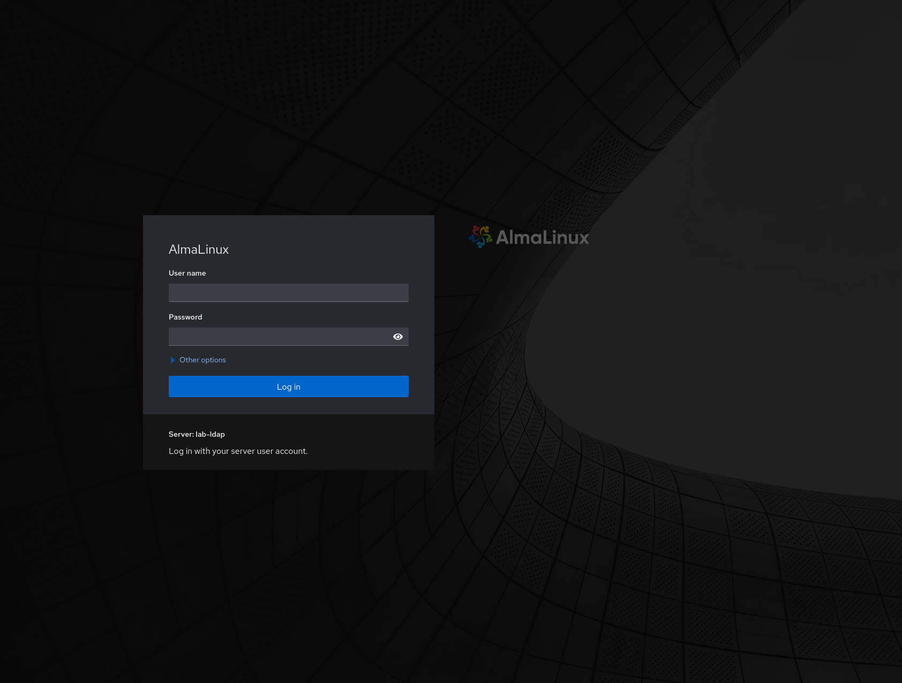
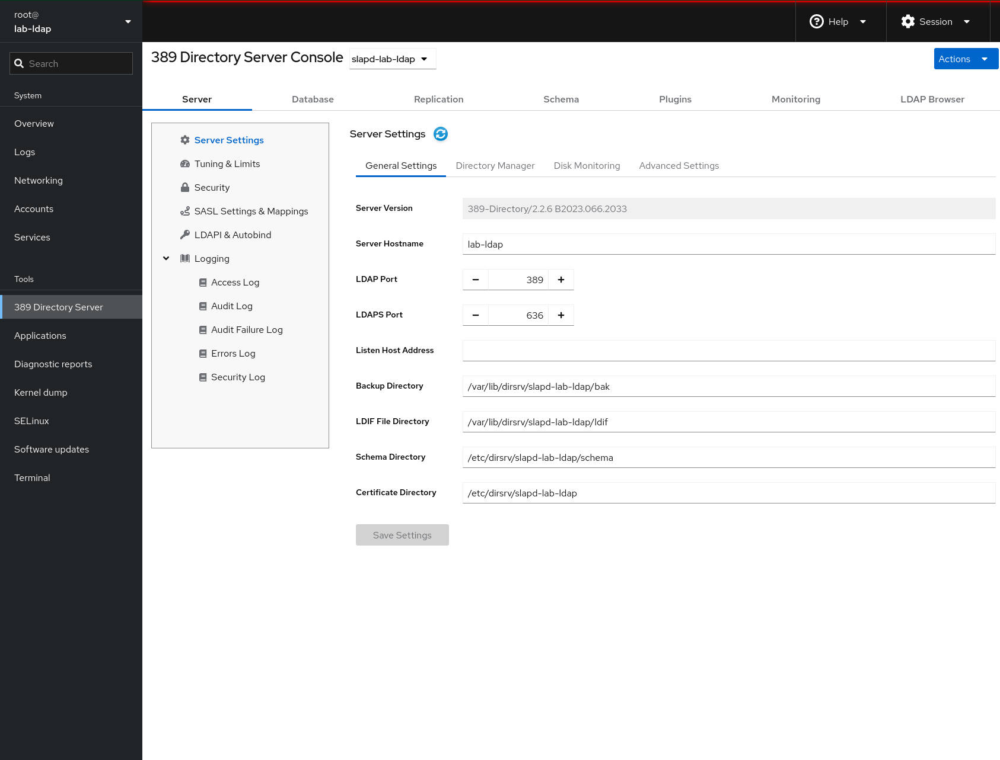
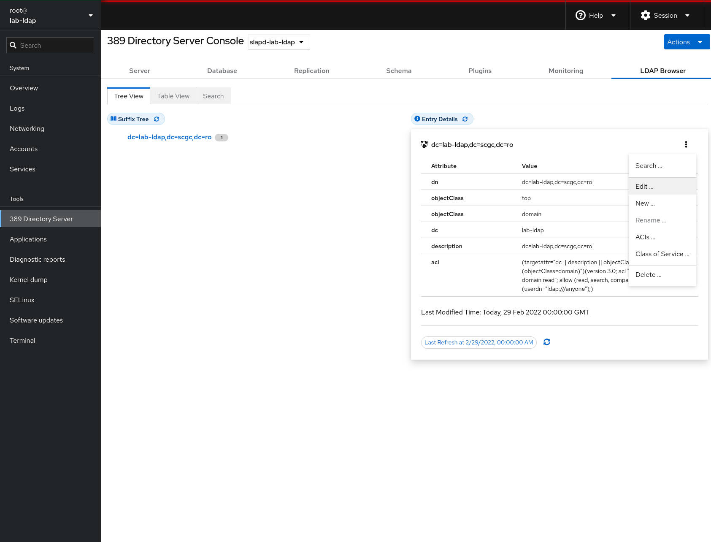
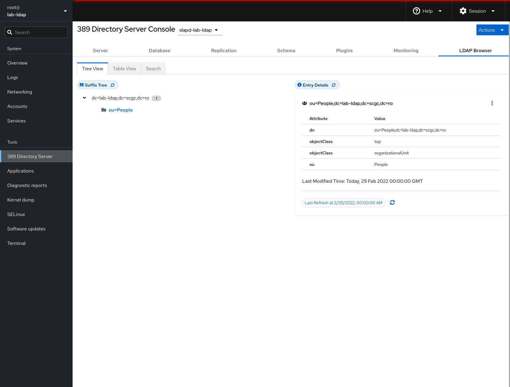

## Connecting to cockpit

As mentioned before, we will be using cockpit to configure the LDAP server.
To enable the cockpit service, run the following command:

```shell-session
[student@lab-ldap ~]$ sudo systemctl enable --now cockpit.socket
```

Since cockpit is a web console for RedHat-based systems, so you will need to
access it from a browser. You can achieve browser access by either:
 1. using dynamic port forwarding through the virtual machine that you have
created in OpenStack;
 2. using X11 forwarding with a browser window from the virtual machine that
you have created in OpenStack (**not** the LDAP virtual machine).

We recommend using the first option, if possible, since it reduces network
traffic the most (only the page's contents are forwarded, instead of a browser
window). Some additional setup is required to use it (i.e., you must use
Firefox and it is recommended that you create a separate profile where you
edit the network settings without changing the default profile).

import Tabs from '@theme/Tabs';
import TabItem from '@theme/TabItem';

<Tabs>
<TabItem value="Dynamic Port Forwarding" label="Dynamic Port Forwarding" default>

To use dynamic port forwarding you will need to be able to access the virtual
machine directly from your system. If you have not set this up, please review
the "Connecting to virtual machines from your system" section in the
[intro lab](../basic/working_with_openstack).

To create a dynamic port forward between your system and the virtual machine
run one of the following commands:
```shell-session
user@local:~$ ssh -fN -D 8220 openstack-10.9.X.Y
# or
user@local:~$ ssh -i ~/.ssh/id_openstack -J user.name@fep.grid.pub.ro -fN -D 8220 student@10.9.X.Y
```

:::note
The SSH process that handles the SOCKS proxy runs in the background, and
the port will be kept occupied while the process is running.
:::

The commands above create a dynamic port forward and open the `8220` on your
system for dynamic port forwarding (a SOCKS proxy is created).

Using a proxied connection through a SOCKS proxy is simple using the Firefox
browser. We recommend that you use a separate profile for proxied connections
to avoid changing your default profile's network settings.

To create a new profile, launch Firefox using the `firefox -P` command. A
small window will appear that allows you to select a profile to launch, or
manage your profiles. Press the `Create Profile...` button and follow the
wizard. At the end of the steps **do not** press `Start Firefox` using the
new profile.



For this guide we will consider that the profile is named `proxy`.
To launch the browser with the new profile, run `firefox -P proxy`.
Every profile keeps a distinct set of settings, so you can use this profile
whenever you need a proxy without changing the settings again (considering
you always use port `8220` as the proxy port).

To configure Firefox to use the proxy, go to the browser's settings menu, and
go to `Settings` &rarr; `General tab` &rarr; `Network Settings` &rarr;
`Settings...`. From here we will select `Manual proxy configuration`, set
`SOCKS Host` to `localhost`, `Port` to `8220`, and enable `Proxy DNS when using
SOCKS v5`.


</TabItem>
<TabItem value="X11 Forwarding" label="X11 Forwarding">

When forwarding browser windows, most of the window will be static. Because
of this, the transfered data can be compressed to reduce network load. To
enable compression pass the `-C` argument to `ssh` for the two connections you
create (to fep, and then to the virtual machine).

For example, when connecting to fep, you can use the following command:

```shell-session
user@local:~$ ssh user.name@fep.grid.pub.ro -X -C -o ServerAliveInterval=100
```

After connecting to the OpenStack virtual machine, install the latest verion
of Firefox and start a window.

```shell-session
student@openstack-vm:~$ sudo apt update
student@openstack-vm:~$ sudo apt install firefox
student@openstack-vm:~$ firefox
```

:::caution
Make sure that you use compression for both connections. If the fep connection
is configured in the SSH configuration file and you use proxy jump, you can
add the `Compression yes` parameter.
:::

</TabItem>
</Tabs>

Once you have a browser window that is able to initiate connections through the
OpenStack virtual machine, you will be able to access
`https://192.168.100.21:9090` for the cockpit service in the LDAP virtual
machine. Since cockpit uses a self-signed certificate, you will have to accept
it manually by navigating to `Advanced...` &rarr; `Accept the Risk and
Continue`. If the setup did not encounter any errors, you will be greeted by a
login screen similar to the one below.

:::caution
Authentication on the web console will require root access. Set a password for
the root account that you will use to authenticate in cockpit. Make sure that
you use a secure password on production systems.
:::




## Managing LDAP through cockpit

Cockpit allows you to configure various services, including the directory
server. Here, you can manage the instance that you have created through the
command line interface, and perform various administrative operations such as
starting or stopping an instance, backing up and restoring instances or
even creating and deleting them.

The image below shows the server configuration page for the instance that we
have configured earlier.



Since LDAP is meant as a database used to store hierarchical information on
users and groups, we will focus on how this information can be managed.


### Adding users to LDAP

We will begin by adding users to LDAP. First, navigate to the `LDAP Browser`
tab and then click on the `dc=lab-ldap,dc=scgc,dc=ro` entry in the `Suffix
Tree`. A new view that contains the entry details will appear, with some
information on the database.

The LDAP server allows us to logically group entities, in order to emulate
an organization's hierarchy. A very basic hierarchy, that we will adopt, is
adding all users in the `People` organizational unit.

Before adding our first user, we will create an organizational unit. To do
this, click on the options button (the buton with three dots in the top right
corner of the view) and then click on `New ...`.



A new window with options will appear. From here, configure the information
as requested (click the `Next` button to go to the next step):
 1. Select `Create a new Organizational Unit`;
 2. Select only the `ou` attribute. More attributes can be added if required
(for example, we could add a phone number), but we will keep the configuration
as simple as possible;
 3. Click on the pen button to edit the attribute. In this example we will
create the `People` organizational unit;
 4. Confirm the creation by clicking on `Create`.

After creating the organizational unit, it will appear under the `Suffix Tree`
in the new hierarchy. In order to create a new user, we will go the the
`People` organizational unit's settings and click the `New ...` button.



From the configuration window, select the following options:
 1. Select `Create a new custom Entry`;
 1. In the `Select ObjectClasses` section search for `person`, and select
 `inetorgperson` and `person`;
 1. In the `Select Attributes` secion select the `cn`, `sn`, `uid` and
 `userPassword` attributes. The `uid` and `userPassword` attributes will be
 required later to authenticate as the user in a Linux virtual machine;
 1. Set values for the parameters. For this user we will set the following
parameters: `cn` = `Luke`, `sn` = `Skywalker`, `uid` = `luke`, and whatever
password you prefer;
 1. Confirm the creation by clicking on `Create`.

At this point we can confirm that the new user is present under the `People`
organizational unit in the tree view. We can also check that the user
has been created by querying the database from the command line. However,
to be able to access the information, you will need to authenticate as the
Directory Manager.

```shell-session
[student@lab-ldap ~]$ ldapsearch -W -D 'cn=Directory Manager' -x -b 'dc=lab-ldap,dc=scgc,dc=ro'
Enter LDAP Password:
# extended LDIF
#
# LDAPv3
# base <dc=lab-ldap,dc=scgc,dc=ro> with scope subtree
# filter: (objectclass=*)
# requesting: ALL
#

# lab-ldap.scgc.ro
dn: dc=lab-ldap,dc=scgc,dc=ro
objectClass: top
objectClass: domain
dc: lab-ldap
description: dc=lab-ldap,dc=scgc,dc=ro

# People, lab-ldap.scgc.ro
dn: ou=People,dc=lab-ldap,dc=scgc,dc=ro
objectClass: top
objectClass: organizationalUnit
ou: People

# Luke, People, lab-ldap.scgc.ro
dn: cn=Luke,ou=People,dc=lab-ldap,dc=scgc,dc=ro
objectClass: top
objectClass: Person
objectClass: InetOrgPerson
objectClass: organizationalPerson
cn: Luke
sn: Skywalker
uid: luke
userPassword:: <<<< someverylongpasswordhash >>>>

# search result
search: 2
result: 0 Success

# numResponses: 4
# numEntries: 3
```

In the command above, the `-D` parameter specifies an identifier for the user
that you will authenticate as in order to extract the data, while `-W` causes
the tool to interactively ask for the password.

You can refine searches by appending an attribute filter at the end. For
example, you could add `'(objectclass=Person)'` as a last parameter in order to
only extract entries that have that class type. By default, the filter is set
to `(objectclass=*)`, as shown in the first lines of the output above.


## Setting up Posix attributes on the user

To import a user in Linux, a few more parameters are required. Go to the user's
entry in the 389 DS cockpit settings, click on the options button and then
`Edit ...`.

In the edit window, enter the following (after each step press `Next`):
 1. Search for the `posixaccount` object class and select it;
 2. Keep the pre-selected attributes selected;
 3. Fill in the empty attributes: `uidNumber` = `9900`, `gidNumber` = `9900`,
`homedirectory` = `/home/luke`;
 4. Confirm that the attributes are properly set;
 5. Confirm the changes by pressing `Modify Entry`.
